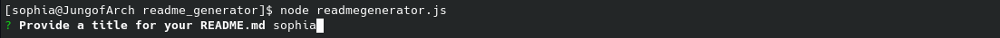
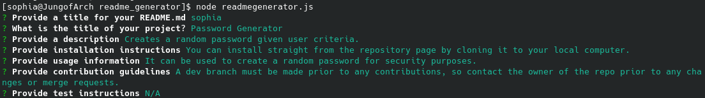
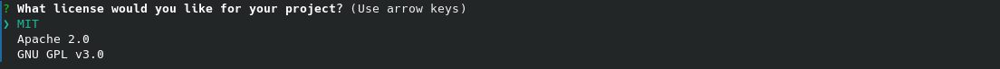
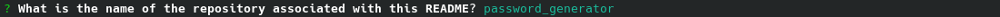
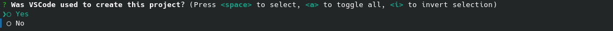
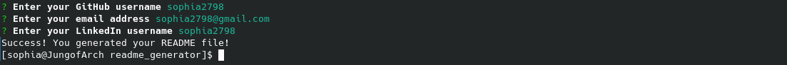

# Good README Generator 
 

## Description
This project allows for a user to create a README by answering a given set of prompts from the command line. At the end, a markdown file is created in the current directory, set with a working Table of Contents and appropriate links. 

## Table Of Contents
- [Access and Installation](#Access-and-Installation)
- [Usage](#Usage)
- [Features](#Features)
- [License](#License)
- [Contribution Guidelines](#Contribution-Guidelines)
- [Test Instructions](#Test-Instructions)
- [Questions](#Questions)

## Access and Installation

No external software or servers are necessary to install this project except for a text editor and a working browser. Cloning this repository to your local computer will be sufficient to be able to run the generator from the command line, given you are in the correct copied directory. The repository includes a .gitignore file and the package.json file needed to install the correct npm pacakges/dependencies. 

This project can be accessed either via the GitHub Repository.

- [GitHub Repository](https://github.com/sophia2798/readme_generator)

To open and edit code files, you will need a text editor. The one used to create this page was Visual Studio Code (https://code.visualstudio.com/).

To install this repository, you can git clone the repository using the green "Code" button. You can copy and paste either the HTML or SSH URL.

## Usage
This project can be used to create good README templates. It includes the necessary, minimum requirements for a comprehensive and complete README. Additional components and information may be added afterwards if needed. 

Additionally, this project can be used to learn more about node.js, dependencies, npm installs, asynchronous functions, and inquirer and fs functions. 

## Features
This project includes...

- A command line prompt asking the user for a unique name for their README so old files are not overwritten

- A set of command line prompt questions asking for informative content with which to populate the README file. 

- A command line list to choose from using the arrow keys and the Enter button. Here, the user can choose what kind of license they want. 

- A command line prompt asking for the repository name so a link can be made in the README to the repository page.

- A command line checkbox question to select using the arrow keys, the Space Bar to select, and Enter button to submit. This asks the user whether they used VS Code as a text editor to create or not create a related badge.

- A final set of command line prompt questions for contact information. Additionally, a success message is displayed to the command line to alert the user they successfully created their README.

Following the completion of the README generation, the README can be read by inputting the following code into the command line. Further edits then be made prior to deployment.

    code .

## License
MIT
A short and simple permissive license with conditions only requiring preservation of copyright and license notices. Licensed works, modifications, and larger works may be distributed under different terms and without source code.

## Contribution Guidelines
Currently, this repository is not set up for contributions. A development branch, to which all merges can be made while protecting the master branch, must be made first. Therefore, please contact the owner(s) of this repository to start and manage such a branch.

Please ensure that PRIOR to any new contributions, you discuss your desired/planned changes via email with the owner(s) of the repository. Contact information can be found in the [Questions](#Questions) section. Changes should be reflected in an updated README as well. To ensure a high quality of code and minimal conflicts, pull requests can only be merged after being approved by another developer. 

To ensure a welcoming working environment, any contributor to this project must help maintain a harassment-free and safe environment. This includes:
    - Using inclusive language
    - Being respectful of various backgrounds and opinions
    - Accepting constructive criticism without aggression or anger
    - Being aware of what benefits the whole community
    - Showing kindness and empathy to one another

## Test Instructions
    npm install
    node readmegenerator.js

## Questions
If you have any questions, please feel free to reach out via email at sdf. Any further information can be found on my [GitHub Profile](https://github.com/wet) or my [LinkedIn Profile](https://linkedin.com/in/we).
